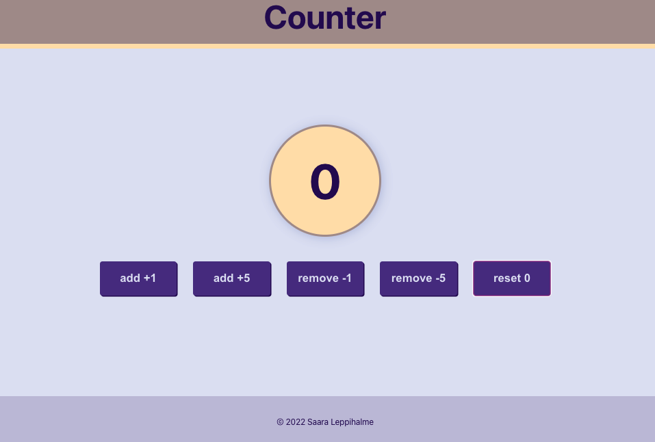
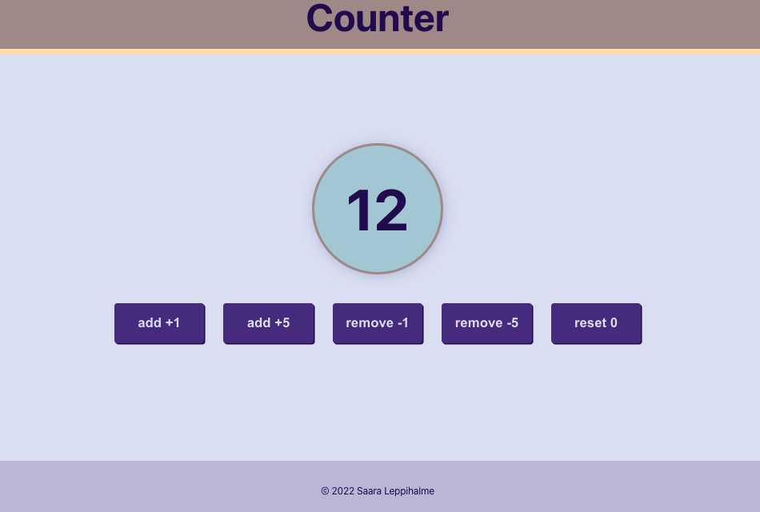
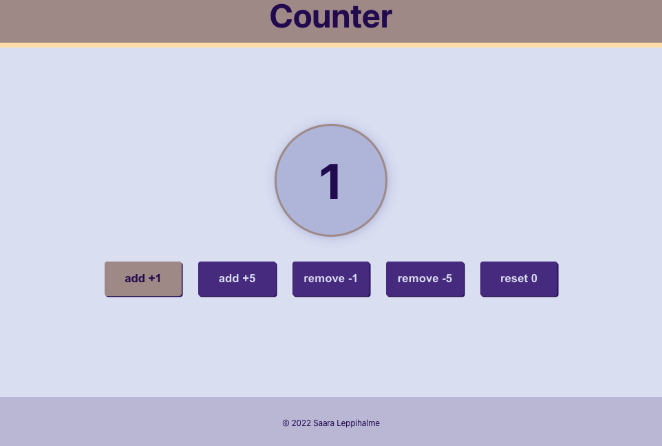

# REACT app with Redux

This is my first react app with REDUX. Task, @ Helsinki Business College, was to build earlier made counter app with Redux without using google, only own notes and own projects in GitHub.
Teacher, [Margit Tennosaar](https://github.com/margittennosaar), gave us hint: '`react-redux, store & provider, reducers, dispatching actions, useSelector, useDispatch`'.

## What the 'Counter app' is about?

By clicking buttons you can add or remove 1 or 5 to counter and reset it. Background of the circle changes if value is even or odd or zero. Counter value's minimum is zero, so it never shows negative values.

## How it was built?

To start building the project first

- installed react:

  ```shell
  npx install create-react-app
  ```

- then redux

  ```shell
  npm install redux
  ```

- then react-redux

  ```shell
  npm install redux
  ```

### Used

- REACT
- Redux
- JSX (JavaScript)
- CSS

## To run the app

```shell
npm start
```

Open [http://localhost:3000](http://localhost:3000) to view it in your browser.

## What I learned and to remember

To start project from scratch forces to think all the steps and for me it is the best way to learn!

Favicon (named `favicon.ico`) directly under public folder and
`<link rel="icon" href="%PUBLIC_URL%/favicon.ico" />`
to index.html

To resize pictures in md.syntax see how done here, below!!

## screenshots




